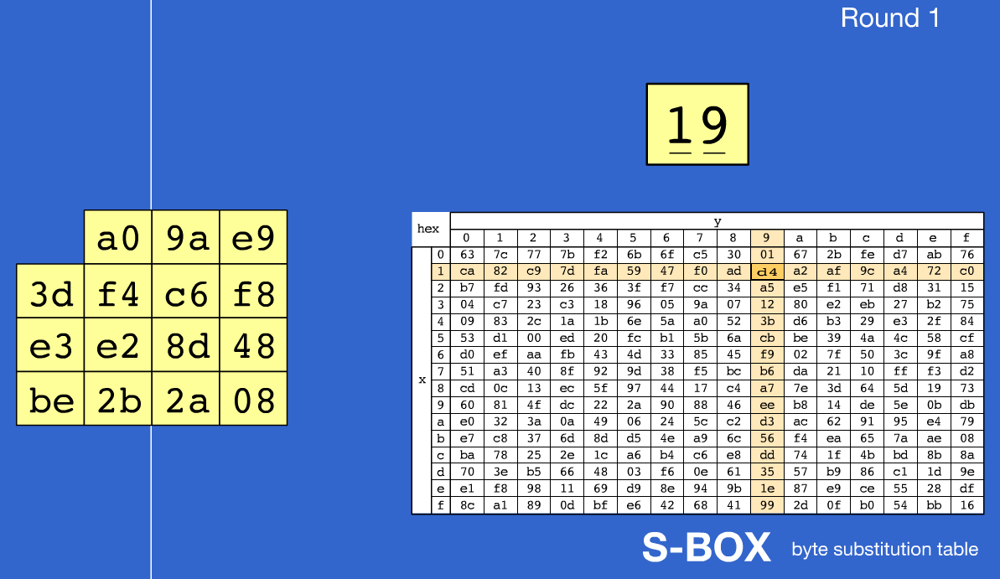
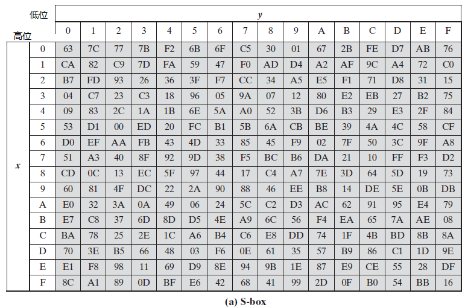
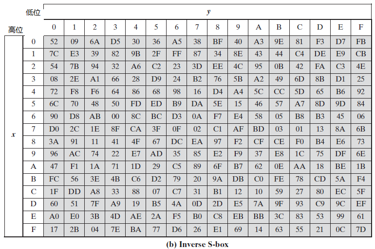
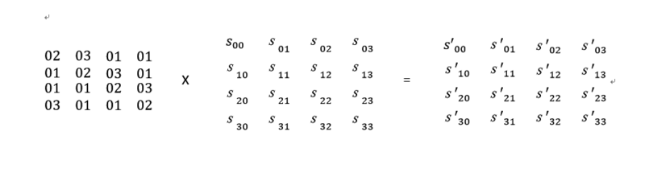
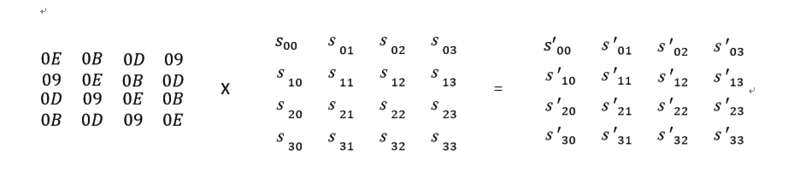
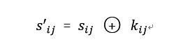
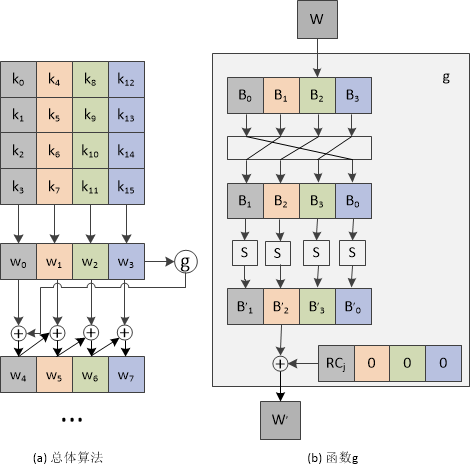

# AES详解

[TOC]

## 一、背景

美国政府在1997年9月12日公开征集更高效更安全的替代DES加密算法，第一轮共有15种算法入选，其中5种算法入围了决赛，分别是MARS，RC6，Rijndael，Serpent和Twofish。又经过3年的验证、评测及公众讨论之后Rijndael算法最终入选。

Rijndael算法之所以最终能够被选为AES的原因是其安全、性能好、效率高、实用灵活。

Rijndael算法支持多种分组及密钥长度，介于128-256之间所有32的倍数均可，最小支持128位，最大256位，而AES标准支持的分组大小固定为128位，密钥长度有3种选择：128位、192位及256位。

## 二、AES算法的数学基础

Rijndaels算法中的许多运算是按字节和4字节的字来定义的。把一个字节看成是在有限域GF(2^8)上的一个元素。有限域（Finite Field）又名伽罗瓦域（Galois field），简单言之就是一个满足特定规则的集合，集合中的元素可以进行加减乘除运算，且运算结果也是属于此集合。

### 1.  加法

在有限域上的加法定义为两个数模2相加（即异或） 

```
a+b = a^b
```

### 2. 乘法

在有限域上的乘法相对于复杂一些，其定义为二进制多项式的成绩模一个次数为8的不可约二进制多项式。该多项式建议为：
$$
m(x) = x^8+x^4+x^3+x+1
$$
转化为编程语言即是：

```
b * 0x01 = a
b * 0x02:  只要b小于0x80，b<<1。如果b大于或等于0x80，(b<<1)^0x1b

乘法分配律：
b * 0x03 = b * (0x02 + 0x01)
         = (b * 0x02) + (b * 0x01)
b * 0x0d = b * (0x08 + 0x04 + 0x01)
         = (b * 0x08) + (b * 0x04) + (b * 0x01)
         = (b * 0x02 * 0x02 * 0x02) + (b * 0x02 * 0x02) + (b * 0x01)
b * 0x09 = b * (0x08 + 0x01)
         = (b * 0x02 * 0x02 * 0x02) + (b * 0x01)
b * 0x0b = b * (0x08 + 0x02 + 0x01)
         = (b * 0x02 * 0x02 * 0x02) + (b * 0x02) + (b * 0x01)
b * 0x0e = b * (0x08 + 0x04 + 0x02)
```

根据以上运算按规则，对于任意两个数相乘都可以将期中一个数分解为n个0x02相乘或加上0x01

## 三、AES算法流程

AES加密算法流程的步骤有：

1. 初始轮密钥加（addRoundKey）
2. 字节替代（byteSub）
3. 行移位（shiftRow）
4. 列混淆（mixColumn）
5. 轮密钥加（addRoundKey）

AES解密算法流程的步骤和是加密的逆过程，如下：

1. 初始轮密钥加（addRoundKey）
2. 逆字节替代（byteSub）
3. 逆行移位（shiftRow）
4. 逆列混淆（mixColumn）
5. 轮密钥加（addRoundKey）

流程如下：


需要注意的是密钥长度不同、数据块长度不同时，算法迭代的轮数也不同。

### 1. 字节替代

ByteSub变换是按字节进行的代替变换，也称为S盒变换。主要功能是通过S盒完成一个字节到另外一个字节的映射,也就是查表替代。S盒的构造[参考资料](https://www.cnblogs.com/Junbo20141201/p/9369860.html)。

正字节替代和逆字节替代的区别是使用的表不同。

例如: 一个字节为`0x5F` 分别取高位5和低位F到S盒中查表。高位当作行，低位当作列。



下面是S盒表和S^-1逆S盒表，逆S盒表用来解密的。






### 2. 行移位

shiftRow 变换是对状态行进行循环移位变换。AES中一个字的表示为1列，也就是按列存储一个字的。

#### 正向行移位

在shiftRow变换中，状态的第0行不移位，第1行循环左移1字节，第2行循环左移2字节，第3行循环左移3字节。


#### 逆向行移位

逆向行移位即是相反的操作，即：第0行保持不变，第1行循环右移1字节，第三行循环右移2字节，第四行循环右移3字节。

### 3. 列混淆

列混淆是AES算法中最复杂的一部分了，也是比较难理解的。mixColumn变换是对状态的列进行混合变换，具体操作如下：

#### 正列混淆



#### 逆列混淆



这两个矩阵是互逆的。


### 4.轮密钥加

这个操作相对简单，其依据的原理是“任何数和自身的异或结果为0”。加密过程中，每轮的输入与轮子密钥异或一次；因此，解密时再异或上该轮的轮子密钥即可恢复。



### 5. 轮函数

根据Rinjdael算法的定义，加密轮数会针对不同的分组及不同的密钥长度选择不同的数值：


AES标准只支持128位分组（Nb = 4）的情况。

### 6. 扩展密钥算法

密钥扩展的原理图如下：

 

　　密钥扩展过程说明：

　　　　1)  将种子密钥按图(a)的格式排列，其中k0、k1、……、k15依次表示种子密钥的一个字节；排列后用4个32比特的字表示，分别记为w[0]、w[1]、w[2]、w[3]；

　　　　2)  按照如下方式，依次求解w[j]，其中j是整数并且属于[4,43]；

　　　　3)  若j%4=0,则w[j]=w[j-4]⊕g(w[j-1]),否则w[j]=w[j-4]⊕w[j-1]；

　　函数g的流程说明：

　　　　a)  将w循环左移8比特；

　　　　b)  分别对每个字节做S盒置换；

　　　　c)  与32比特的常量（RC[j/4],0,0,0）进行异或，RC是一个一维数组，其值如下。（RC的值只需要有10个，而此处用了11个，实际上RC[0]在运算中没有用到，增加RC[0]是为了便于程序中用数组表示。由于j的最小取值是4，j/4的最小取值则是1，因此不会产生错误。）

　　　　　　RC = {0x00, 0x01, 0x02, 0x04, 0x08, 0x10, 0x20, 0x40, 0x80, 0x1B, 0x36}

## 四、具体实现

现在讲解具体的加密过程，并且利用python实现128位的AES算法

选择密钥和明文如下：

```python 
key = 0x00012001710198aeda79171460153594
plaintext = 0x0001000101a198afda78173486153566
```

生成的加密扩展密钥：

```
00012001710198aeda79171460153594
589702d129969a7ff3ef8d6b93fab8ff
77fb140d5e6d8e72ad8203193e78bbe6
cf119abf917c14cd3cfe17d40286ac32
8380b9c812fcad052e02bad12c8416e3
ccc7a8b9de3b05bcf039bf6ddcbda98e
9614b13f482fb483b8160bee64aba260
b42e617cfc01d5ff4417de1120bc7c71
513ec2cbad3f1734e928c925c994b554
68ebe216c5d4f5222cfc3c07e5688953
1b4c0fcfde98faedf264c6ea170c4fb9
```

生成轮密钥算法：

```python
#轮秘钥生成
    def keyExpansion(self, cipher_key):
        self.round_keys = text_to_matrix(cipher_key)
        #生成10个轮秘钥
        for i in range(4, 4 * 11):
            self.round_keys.append([])
            if i % 4 == 0:
                tmp = self.round_keys[i-1][1:]+self.round_keys[i-1][:1]
                for j in range(4):
                    row = tmp[j] >> 4
                    column = tmp[j] & 0x0f
                    if j == 0:
                        byte = self.round_keys[i-4][0] ^ SBox[row][column] \
                        	   ^ Rcon[i // 4]
                        self.round_keys[i].append(byte)
                    else:
                        byte = self.round_keys[i-4][j] ^ SBox[row][column]
                        self.round_keys[i].append(byte)
            else:
                for j in range(4):
                    byte = self.round_keys[i - 4][j] ^ self.round_keys[i - 1][j]
                    self.round_keys[i].append(byte)
```

### 1. 初始轮密钥加

经过轮密钥加后

```
    input: 00012001710198aeda79171460153594
round_key: 00012001710198aeda79171460153594
   output: 0000200070a0000100010020e60000f2
```

代码：

```python
#轮秘钥加变换
def addRoundKey(self, state_matrix, key_matrix):
        for i in range(4):
            for j in range(4):
                state_matrix[i][j] ^= key_matrix[i][j]
        return state_matrix
```

### 2. 字节替代

```
    input: 0000200070a0000100010020e60000f2
round_key: 589702d129969a7ff3ef8d6b93fab8ff
   output: 6363b76351e0637c637c63b78e636389
```

代码：

```python
#S盒变换
    def byteSub(self, matrix):
        for i in range(4):
            for j in range(4):
                a = matrix[i][j]
                row = a >> 4
                column = a & 0x0f
                matrix[i][j] = SBox[row][column]
```

### 3. 行移位

```
    input: 6363b76351e0637c637c63b78e636389
round_key: 589702d129969a7ff3ef8d6b93fab8ff
   output: 63e06389517c63636363b77c8e6363b7
```

代码：

```python
#行移位变换
def shiftRow(self, matrix):
        result = []
        for j in range(4):
            result.append([])
            for i in range(4):
                tmp = matrix[shiftTable[j][i]][i]
                result[j].append(tmp)
        self.state = result
```

### 4. 列混淆

```
    input: 63e06389517c63636363b77c8e6363b7
round_key: 589702d129969a7ff3ef8d6b93fab8ff
   output: 1794c52f266f4e2aa81bf189765ae9fc
```

代码：

```python
#列混合变换
def mixColumn(self, matrix):
    mul_by_2 = gf_mul_by_02
    mul_by_3 = gf_mul_by_03
    j = 0
    for i in range(4):
        v0, v1, v2, v3 = matrix[i]
        matrix[i][j] = mul_by_2[v0] ^ mul_by_3[v1] ^ v2 ^v3
        matrix[i][j+1] = v0 ^ mul_by_2[v1] ^ mul_by_3[v2] ^ v3
        matrix[i][j+2] = v0 ^ v1 ^ mul_by_2[v2] ^ mul_by_3[v3]
        matrix[i][j+3] = mul_by_3[v0] ^ v1 ^ v2 ^ mul_by_2[v3]
```

### 5. 轮密钥加

```
    input: 1794c52f266f4e2aa81bf189765ae9fc
round_key: 589702d129969a7ff3ef8d6b93fab8ff
   output: 63e06389517c63636363b77c8e6363b7
```

本次使用的函数和初始轮密钥加为同一函数，只是密钥不同。

至此，第一轮加密完成，剩下的九轮顺序一样，只是使用的密钥不同，需要注意的是，最后一轮不使用列混淆。

## 五、加密结果

```python
#####################  encryption  #####################

key = 0x00012001710198aeda79171460153594
plaintext = 0x0001000101a198afda78173486153566

N = 1
    After byteSub: 6363b76351e0637c637c63b78e636389

   After shiftRow: 63e06389517c63636363b77c8e6363b7

  After mixColumn: 1794c52f266f4e2aa81bf189765ae9fc

        round_key: 589702d129969a7ff3ef8d6b93fab8ff

After addRoundKey: 4f03c7fe0ff9d4555bf47ce2e5a05103

N = 2
    After byteSub: 847bc6bb769948fc39bf1098d9e0d17b

   After shiftRow: 8499107b76bfd1bb39e0c6fcd97b4898

  After mixColumn: c8e6b0e85cc0a699734f518ef46f8168

        round_key: 77fb140d5e6d8e72ad8203193e78bbe6

After addRoundKey: bf1da4e502ad28ebdecd5297ca173a8e

N = 3
    After byteSub: 8a449d9779534e91dbd008874f08019

   After shiftRow: 895001977bd80d91df049e974a43488

  After mixColumn: ad20b6bf6b54a10d91d45f57a3f33b07

        round_key: cf119abf917c14cd3cfe17d40286ac32

After addRoundKey: 62312c00fa28b5c0ad2a4883a1759735

N = 4
    After byteSub: aac771632d34d5ba95e552ec329d8896

   After shiftRow: aa3452962de58863959d71ba32c7d5ec

  After mixColumn: d7a29bb4851c66dc469d3f270f2f6b87

        round_key: 8380b9c812fcad052e02bad12c8416e3

After addRoundKey: 5422227c97e0cbd9689f85f623ab7d64

N = 5
    After byteSub: 2093931088e11f3545db97422662ff43

   After shiftRow: 20e1974388dbff104562933526931f42

  After mixColumn: ac183190922f86878a1a4554bf784d62

        round_key: ccc7a8b9de3b05bcf039bf6ddcbda98e

After addRoundKey: 60df99294c14833b7a23fa3963c5e4ec

N = 6
    After byteSub: d09eeea529faece2da262d12fba669ce

   After shiftRow: d0fa2dce292669a5daa6eee2fb9eec12

  After mixColumn: 4d86393bf47b2965524686e2aae19040

        round_key: 9614b13f482fb483b8160bee64aba260

After addRoundKey: db928804bc549de6ea508d0cce4a3220

N = 7
    After byteSub: b94fc4f265205e8e87535dfe8bd623b7

   After shiftRow: b9205db7655323f287d6c48e8b4f5efe

  After mixColumn: e3a9e1d8ee547d203ee94b877c096170

        round_key: b42e617cfc01d5ff4417de1120bc7c71

After addRoundKey: 578780a41255a8df7afe95965cb51d01

N = 8
    After byteSub: 5b17cd49c9fcc29edabb2a904ad5a47c

   After shiftRow: 5bfc2a7cc9bba449dad5cd9e4a17c290

  After mixColumn: ffba77c3b21afacd98b9374affa96930

        round_key: 513ec2cbad3f1734e928c925c994b554

After addRoundKey: ae84b5081f25edf97191fe6f363ddc64

N = 9
    After byteSub: e45fd530c03f5599a381bba805278643

   After shiftRow: e43fbb43c0818630a327d599055f55a8

  After mixColumn: 6a0f7335b578063c7810852516ec134e

        round_key: 68ebe216c5d4f5222cfc3c07e5688953

After addRoundKey: 2e4912370acf31e54ecb922f3849a1d

N = 10
    After byteSub: 7769812651910d7220ce56930d5fb8a4

   After shiftRow: 779156a451ceb826205f81720d690d93

  After mixColumn: 779156a451ceb826205f81720d690d93

        round_key: 1b4c0fcfde98faedf264c6ea170c4fb9

After addRoundKey: 6cdd596b8f5642cbd23b47981a65422a
```

## 六、解密结果

```python
#####################  decryption  #####################

key = 0x00012001710198aeda79171460153594
ciphertext = 0x6cdd596b8f5642cbd23b47981a65422a

N = 10
  After inv_byteSub: 2acb91d70ec9a235484911ef3e4f322

 After inv_shiftRow: 2e4912370acf31e54ecb922f3849a1d

After inv_mixColumn: 6dfd56924b4eaa9e86732dfb93db01b9

          round_key: 89c2edd18bcf2cae2554f86296845411

  After addRoundKey: e43fbb43c0818630a327d599055f55a8

N = 9
  After inv_byteSub: ae25fe641f91dc08713db5f93684ed6f

 After inv_shiftRow: ae84b5081f25edf97191fe6f363ddc64

After inv_mixColumn: d5a3fb1acbb66536744e1952f9c76ee3

          round_key: 8e5fd166020dc17fae9bd4ccb3d0ac73

  After addRoundKey: 5bfc2a7cc9bba449dad5cd9e4a17c290

N = 8
  After inv_byteSub: 5755950112fe1da47ab580df5c87a896

 After inv_shiftRow: 578780a41255a8df7afe95965cb51d01

After inv_mixColumn: 8810acc0e90133eb2b40d13d96042641

          round_key: 3130f1778c521019ac9615b31d4b78bf

  After addRoundKey: b9205db7655323f287d6c48e8b4f5efe

N = 7
  After inv_byteSub: db548d20bc503204ea4a88e6ce929d0c

 After inv_shiftRow: db928804bc549de6ea508d0cce4a3220

After inv_mixColumn: a97f6b78944488cbfa62eb484a43811e

          round_key: 798546b6bd62e16e20c405aab1dd6d0c

  After addRoundKey: d0fa2dce292669a5daa6eee2fb9eec12

N = 6
  After inv_byteSub: 6014faec4c23e4297ac5993b63df8339

 After inv_shiftRow: 60df99294c14833b7a23fa3963c5e4ec

After inv_mixColumn: bbd15c394c3c58c8d8c477f1b78a77e4

          round_key: 9b30cb7ac4e7a7d89da6e4c4911968a6

  After addRoundKey: 20e1974388dbff104562933526931f42

N = 5
  After inv_byteSub: 54e08564979f7d7c68ab22d92322cbf6

 After inv_shiftRow: 5422227c97e0cbd9689f85f623ab7d64

After inv_mixColumn: 8322e3c7232e4c1ccdc32a63e78598e

          round_key: a2067caa5fd76ca25941431c0cbf8c62

  After addRoundKey: aa3452962de58863959d71ba32c7d5ec

N = 4
  After inv_byteSub: 62284835fa2a9700ad752cc0a131b583

 After inv_shiftRow: 62312c00fa28b5c0ad2a4883a1759735

After inv_mixColumn: 4d65fdaa8a6c90d11b666657215afbf6

          round_key: 45f0fdb3fdd1100806962fbe55fecf7e

  After addRoundKey: 895001977bd80d91df049e974a43488

N = 3
  After inv_byteSub: bfad528e02cd3ae5de17a4ebca1d2897

 After inv_shiftRow: bf1da4e502ad28ebdecd5297ca173a8e

After inv_mixColumn: 3603f026ce9e3c00c2a7f94a8a13a858

          round_key: b29ae05db821edbbfb473fb65368e0c0

  After addRoundKey: 8499107b76bfd1bb39e0c6fcd97b4898

N = 2
  After inv_byteSub: 4ff97c030ff451fe5ba0c755e503d4e2

 After inv_shiftRow: 4f03c7fe0ff9d4555bf47ce2e5a05103

After inv_mixColumn: 31b953ae5bc76e8520056571264cbcc1

          round_key: 525930270abb0de64366d20da82fdf76

  After addRoundKey: 63e06389517c63636363b77c8e6363b7

N = 1
  After inv_byteSub: a000f27001000000002001e6000020

 After inv_shiftRow: 200070a0000100010020e60000f2

After inv_mixColumn: 200070a0000100010020e60000f2

          round_key: 12001710198aeda79171460153594

  After addRoundKey: 1000101a198afda78173486153566
```

